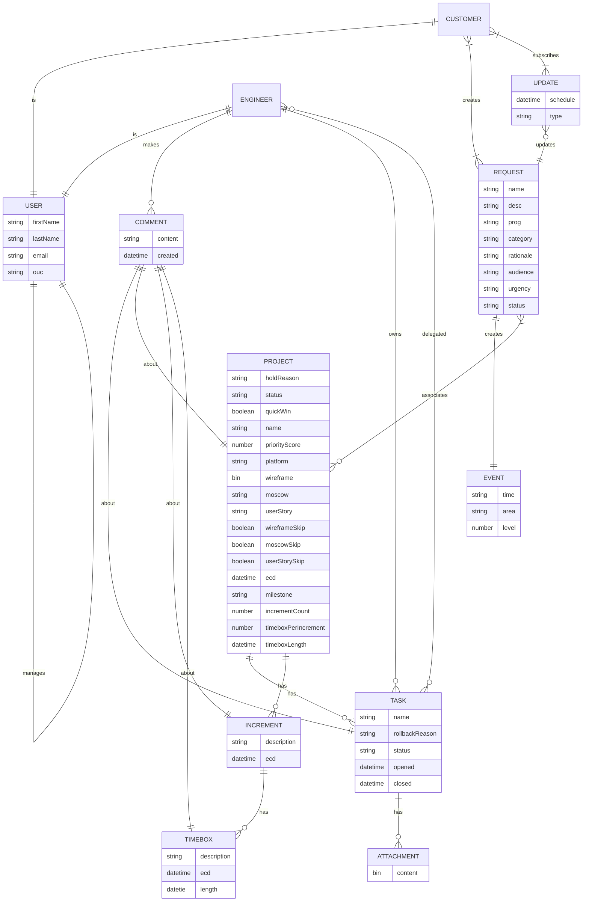
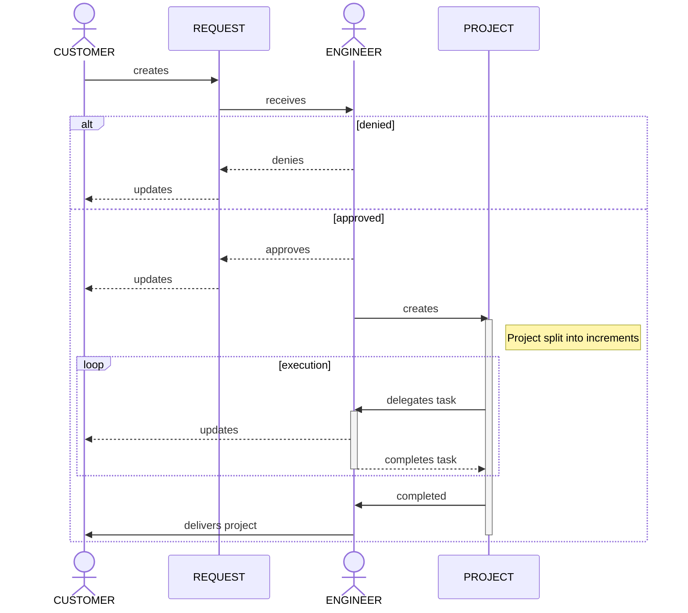
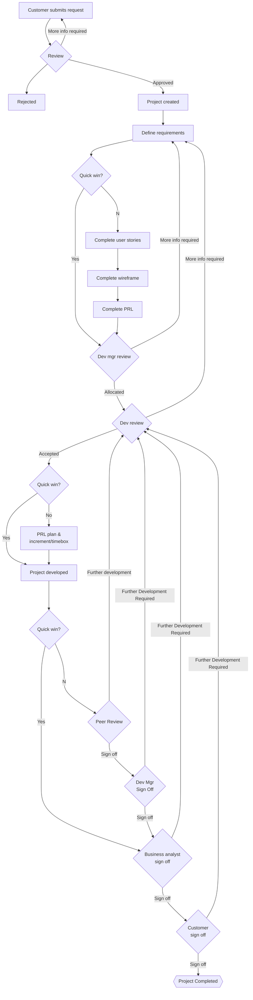

# Grand Central

It is a system whereby customers can make requests for collateral from the data team (reports, etc). The request, when accepted, results in a project, which the system also manages by decomposing the project into increments and timeboxes.

## Entity Relationships

## Sequence Diagrams

### Project creation

## Flow diagram

